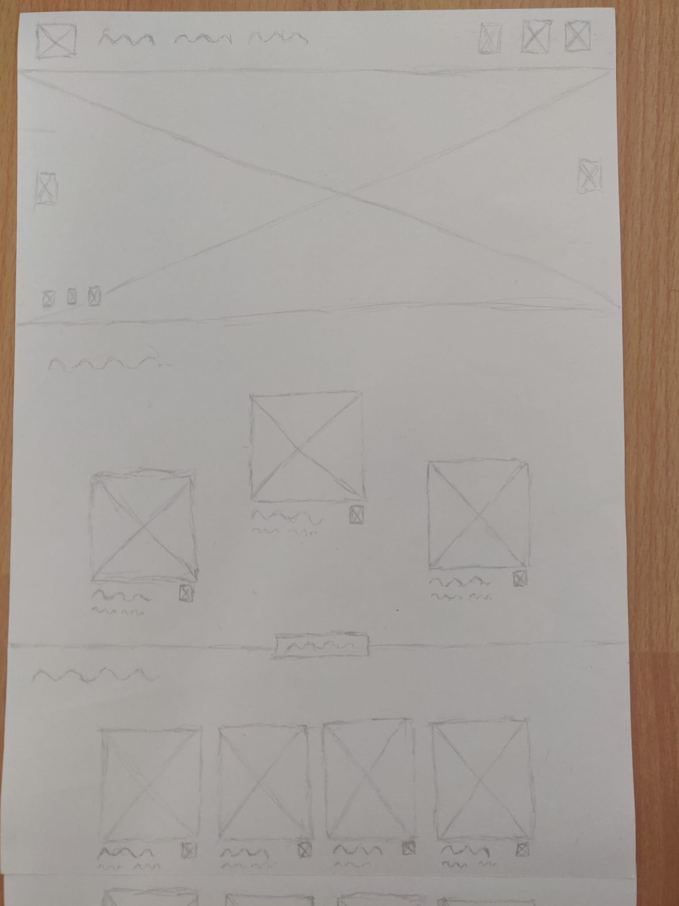
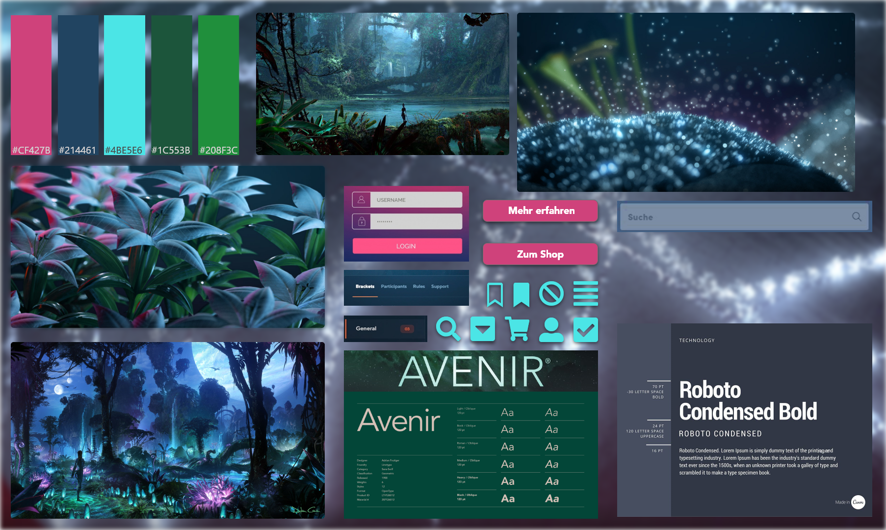
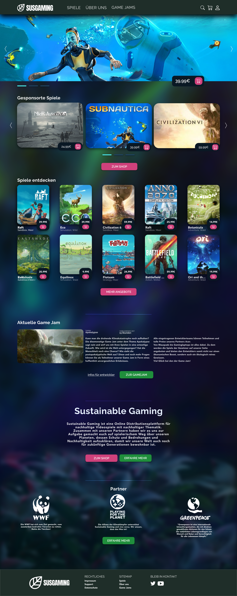
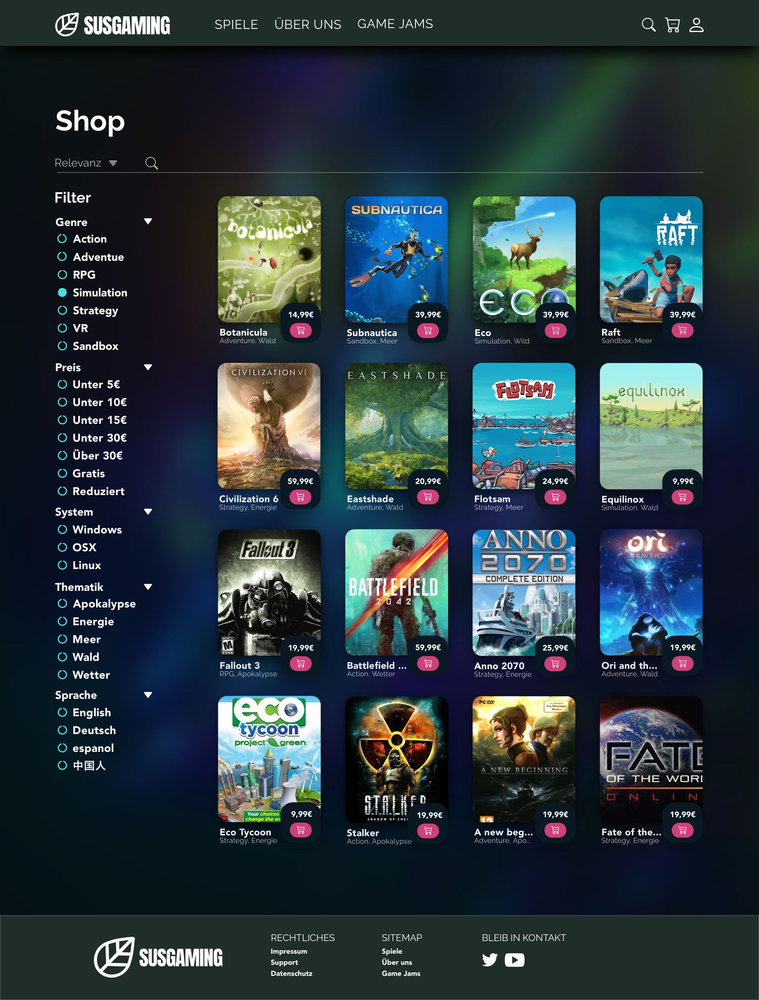

# Sustainable Gaming - UX/UI Design Study

**University group project, 2021**

Sustainable Gaming is a concept for a digital games marketplace paired with a themed Game Jam. The design explores how a familiar store experience can surface sustainability themes through discovery, categorisation, product pages, and community participation.

This repository is intentionally a design case study. It documents the process and final artefacts; it does not contain the original application source code.

## Design development

### 1. Wireframes

Early hand-drawn wireframes were used to structure the main navigation, landing page, store, and information pages before visual styling.

- [Full wireframe set by Tom Kertels](docs/wireframes/Tom-Kertels-Wireframes.pdf)
- [Individual wireframe sketches](docs/wireframes/)

### 2. Visual direction

The moodboards establish the dark blue-green base, bright cyan and pink accents, condensed headings, and nature-inspired imagery that carry through the final prototype.

- [Main moodboard](docs/moodboards/SustainableGaming-Moodboard.png)
- [Team moodboards](docs/moodboards/)

### 3. Prototype and high-fidelity screens

The visual system was applied to the landing page, catalogue, product detail view, Game Jam, account flows, and supporting information pages.

- [Early low-fidelity prototype](docs/prototypes/Early-Prototype.pdf)
- [Final high-fidelity mockups](docs/prototypes/High-Fidelity-Mockups.pdf)
- [Original Adobe XD source files](docs/source-files/)
